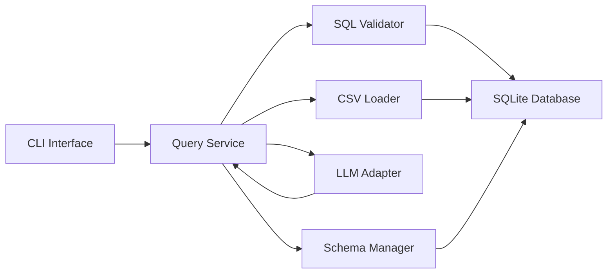

# DataSheet AI System (EC530)

A modular Python + SQLite data system that ingests CSV files, translates natural language to SQL (optionally with an LLM), validates SQL safely, and returns query results.

## Author

- Name: Boyang Zhang
- Email: theostnc@bu.edu
- Video: https://drive.google.com/drive/folders/1uAf2cjPlJ-EatFB4DTf0W1JSEH74kQ02?usp=drive_link

This implementation follows the `DataSheetAI.pdf` assignment constraints:
- Python + SQLite
- Modular architecture
- Unit tests with `pytest`
- CI with GitHub Actions
- LLM output treated as untrusted input and always validated

## System Overview

Core modules:
- `CSVLoader`: Reads CSV with `pandas.read_csv()` and inserts rows manually (no `df.to_sql()`).
- `SchemaManager`: Discovers and manages schema, checks compatibility, and creates tables with `id INTEGER PRIMARY KEY AUTOINCREMENT`.
- `SQLValidator`: Allows only safe `SELECT`-only SQL and rejects unknown tables/columns.
- `LLMAdapter`: Converts natural language to SQL (rule-based fallback and optional OpenAI adapter).
- `QueryService`: Central orchestration layer used by all clients.
- `CLI`: Interactive interface that only talks to `QueryService` (never direct DB access).

## Component Diagram



## Project Structure

```text
src/datasheet_ai/
  cli.py
  csv_loader.py
  errors.py
  llm_adapter.py
  models.py
  query_service.py
  schema_manager.py
  sql_validator.py
tests/
.github/workflows/ci.yml
AI_USAGE.md
docs/API_SPEC.md
```

## How to Run

1. Install dependencies:

```bash
python3 -m pip install -e ".[dev]"
```

2. Run CLI:

```bash
python3 -m datasheet_ai --db-path data/system.db
```

3. Optional OpenAI-backed adapter:

```bash
export OPENAI_API_KEY="your_key_here"
python3 -m pip install -e ".[llm]"
python3 -m datasheet_ai --db-path data/system.db --use-openai
```

## CLI Usage

```text
help
load examples/sales.csv sales
tables
schema
sql SELECT product, revenue FROM "sales" ORDER BY revenue DESC LIMIT 3
ask show top 5 rows
exit
```
 
## How to Run Tests

```bash
pytest
```

## Design Decisions

- `QueryService` is the only module that executes user/LLM SQL.
- SQL validator behavior is defined by explicit tests.
- LLM output is not trusted and must pass validator checks before execution.
- Schema compatibility is based on normalized column names and exact data types.
- Schema conflicts support `rename`, `overwrite`, and `skip`.
- If schema conflict is detected in CLI, the user is prompted to choose `rename`, `overwrite`, or `skip`.

## Limitation

`SQLValidator` intentionally uses lightweight structure checks + SQLite compile checks (not a full SQL parser). This keeps the design simple and testable, but complex SQL dialect edge cases are intentionally out of scope.
